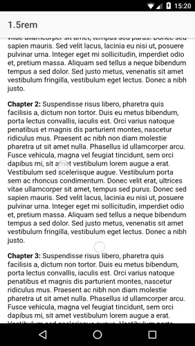

## Related post: [Using the Pinch Gesture in Ionic 2+](https://www.ionicrun.com/using-the-pinch-gesture-in-ionic-2/)

<p align="center">
  
</p>

## Step by step

```bash
$ git clone https://github.com/ionicrun/using-the-pinch-gesture-in-ionic-2.git
$ cd using-the-pinch-gesture-in-ionic-2
```

```bash
$ npm i
# or
$ ionic cordova platform add android ios
```

## Done

You're all set! Go ahead and serve or run the App and see the Using the Pinch Gesture in Ionic 2+ in action!

```bash
$ ionic serve
# or
$ ionic cordova run ios
# or
$ ionic cordova run android
```
